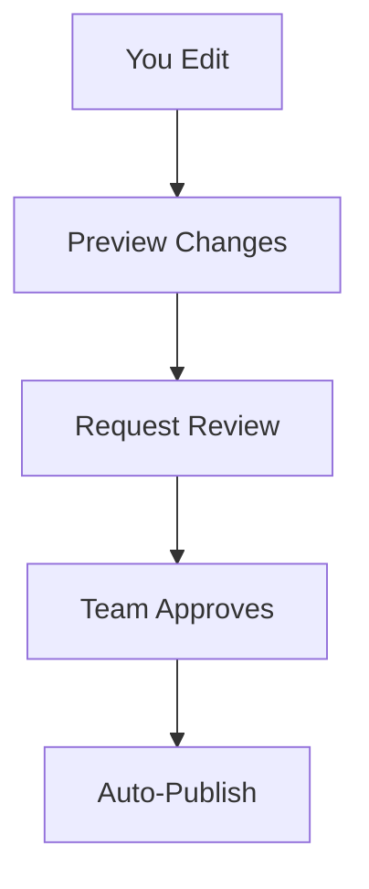

## Overview

You manage your documentation through a structured platform centered on `spaces`, `projects`, and automated workflows. These core concepts form the foundation for organizing content, collaborating with teams, and maintaining version history. Start by creating a space to group related projects, then build documentation within them using familiar tools like Markdown and MDX.

<Callout kind="info">
  Familiarize yourself with these concepts before diving into advanced features like custom integrations.
</Callout>

## Key Concepts

Use these building blocks to structure your documentation effectively.

<Columns cols={3}>
  <Card title="Spaces" icon="layers">
    Central hubs for grouping projects and documentation. Create one space per client or product.
  </Card>
  <Card title="Projects" icon="folder">
    Individual repositories within spaces. Each project holds MDX files, assets, and configs.
  </Card>
  <Card title="Workflows" icon="git-branch">
    Automated pipelines for publishing, reviewing, and deploying changes.
  </Card>
</Columns>

## Documentation Spaces

Spaces act as your top-level containers. You create a space to organize multiple projects under a common theme, such as a product line or team initiative. Each space supports custom branding, permissions, and integrations.

For example, configure a space with your brand color `#3B82F6` for consistent theming across all projects.

<Expandable title="Advanced Space Settings" default-open="false">
  Access space settings via the dashboard at `https://dashboard.example.com/spaces/your-space-id/settings`. Key options include:
  
  | Setting       | Description                          | Default |
  |---------------|--------------------------------------|---------|
  | Brand Color   | Hex code for UI elements             | `#3B82F6` |
  | Public Access | Toggle read-only viewing             | Private |
  | Webhooks      | Integrate with external services     | Off     |
</Expandable>

## Project Organization Structure

Organize projects hierarchically within spaces. A typical structure looks like this:

```
your-space/
├── README.mdx
├── docs/
│   ├── introduction.mdx
│   └── concepts.mdx
├── assets/
│   └── images/
└── config.json
```

Use folders to separate concerns: `docs/` for content, `assets/` for media, and root files for metadata.

<Tabs>
  <Tab title="Simple Project" icon="folder">
    Ideal for single-document sites.
    
    ```bash
    mkdir my-project
    cd my-project
    echo "# Welcome" > README.mdx
    ```
  </Tab>
  <Tab title="Multi-Doc Project" icon="layers">
    Scale to full documentation suites.
    
    ```bash
    mkdir docs-site
    mkdir docs-site/docs
    touch docs-site/docs/{introduction,concepts}.mdx
    ```
  </Tab>
</Tabs>

## Version Control Basics

Integrate Git for tracking changes. You commit MDX files directly, and the platform handles previews and merges.

<CodeGroup tabs="Git CLI,Platform UI">
  ```bash
  git init
  git add docs/concepts.mdx
  git commit -m "Add core concepts documentation"
  git push origin main
  ```
  ```markdown
  <!-- Platform UI steps -->
  1. Edit file in web editor
  2. Review changes
  3. Commit with message
  ```
</CodeGroup>

<Callout kind="tip">
  Always write descriptive commit messages like `docs(guide): explain project structure` for better history.
</Callout>

## Collaboration Model

Teams collaborate via real-time editing and role-based access. Assign roles like Editor, Reviewer, or Viewer at the space or project level.



Reviewers use inline comments and suggestions, similar to GitHub PRs.

## Workflow Automation Concepts

Automate repetitive tasks with workflows. Define triggers like `on-push` or `on-merge` to run builds, linting, or deployments.

<Steps>
  <Step title="Create Workflow" icon="settings">
    Navigate to project settings > Workflows.
    
    ````yaml
    name: Publish Docs
    on: [push]
    jobs:
      build:
        runs-on: ubuntu-latest
        steps:
          - uses: actions/checkout@v3
    ````
  </Step>
  <Step title="Test Workflow" icon="play">
    Push a change to trigger the pipeline.
  </Step>
  <Step title="Monitor Logs" icon="activity">
    View real-time execution in the dashboard.
  </Step>
</Steps>

Master these concepts to streamline your documentation process. Next, explore [project setup](/quickstart) for hands-on implementation.