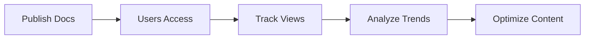

## Overview

Дмитрий Белоусов provides a comprehensive suite of tools to streamline your documentation workflow. You manage content, collaborate with teams, and gain insights into usage patterns. Key features include advanced editing tools, powerful search capabilities, flexible export options, theme customization, and detailed analytics.

<Columns cols={3}>
  <Card title="Document Editing" icon="edit-3" href="#document-editing">
    Rich text editing with MDX support and real-time collaboration.
  </Card>
  <Card title="Search & Indexing" icon="search" href="#search-indexing">
    Full-text search across all documents with instant results.
  </Card>
  <Card title="Export Options" icon="download" href="#export-sharing">
    Export to PDF, HTML, or Markdown with sharing links.
  </Card>
  <Card title="Customization" icon="palette" href="#customization">
    Brand your docs with custom themes and colors like `#3B82F6`.
  </Card>
  <Card title="Analytics" icon="bar-chart-3" href="#analytics">
    Track views, searches, and engagement metrics.
  </Card>
</Columns>

## Document Editing and Formatting

You edit documents using a WYSIWYG editor that supports MDX syntax for interactive components. Insert headings, lists, code blocks, and embeds seamlessly. Real-time previews ensure your content renders correctly.

<CodeGroup tabs="Markdown,MDX">
  ```markdown
  ## Heading

  - List item
  - Another item
  ```
  ```jsx
  ## Heading with Component

  <Callout kind="info">
    This is interactive content.
  </Callout>
  ```
</CodeGroup>

<Callout kind="tip">
  Use the preview pane to test components before publishing.
</Callout>

## Search and Indexing Functions

Дмитрий Белоусов indexes your entire documentation site for lightning-fast searches. You query across titles, content, and metadata. Advanced filters let you narrow by tags or sections.

Enable custom indexing via API:

```javascript
POST https://api.example.com/v1/index
Authorization: Bearer YOUR_API_KEY

{
  "pages": ["/docs/features"],
  "tags": ["guide", "api"]
}
```

## Export and Sharing Options

Share your docs effortlessly. Generate public links or export bundles.

<Tabs>
  <Tab title="PDF Export" icon="file-text">
    Select pages and download as PDF with your branding.
  </Tab>
  <Tab title="HTML Bundle" icon="globe">
    Create a static site for hosting anywhere.
  </Tab>
  <Tab title="Markdown ZIP" icon="package">
    Export source files for Git integration.
  </Tab>
</Tabs>

## Customization Themes and Branding

Tailor your docs to match your brand. Upload logos, set primary colors, and choose layouts.

<Steps>
  <Step title="Access Settings" icon="settings">
    Navigate to Dashboard > Themes.
  </Step>
  <Step title="Upload Assets" icon="upload">
    Add your logo and favicon.
  </Step>
  <Step title="Set Colors" icon="palette">
    Enter hex codes like `#3B82F6` for primary.
  </Step>
  <Step title="Preview & Save" icon="eye">
    Review changes and publish.
  </Step>
</Steps>

For advanced CSS:

````css
:root {
  --primary-color: #3B82F6;
}
````

## Analytics and Usage Insights

Monitor how users interact with your docs. View top pages, search queries, and bounce rates.

<Expandable title="Advanced Metrics" default-open="false">

| Metric          | Description                          | Example Value |
|-----------------|--------------------------------------|---------------|
| Page Views      | Total visits per page                | 1,250         |
| Avg. Time       | Time spent reading                   | 2m 45s        |
| Search Queries  | Popular searches                     | "API setup"   |
| Bounce Rate     | Single-page visits                   | `<20%`        |

Integrate with external tools via webhooks.

</Expandable>



These features empower you to create professional, user-friendly documentation efficiently. Start by exploring the editor to see immediate improvements.